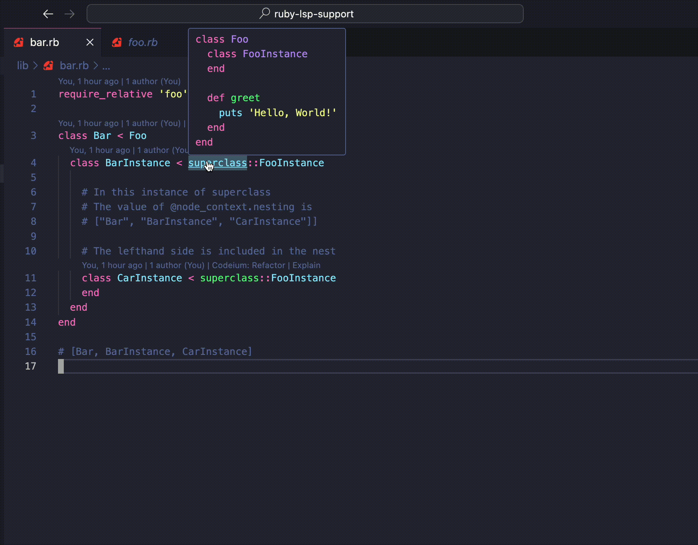
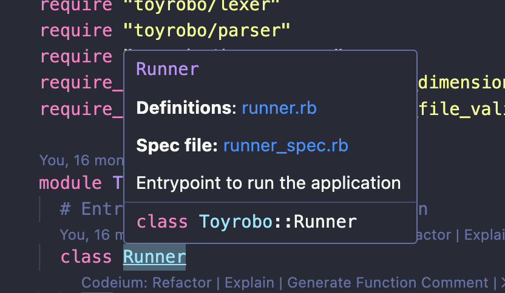

# Description
The missing Ruby-LSP utilities

# Features
## Go To Defintion of Superclass
Jump to the source of a `superclass`

## Jump to spec
Guesses the spec file and adds displays a shortcut link

